# AI 能力测评系统 · Agent 设计文档

> 这份文档按**设计问题**来组织，而不是按文件顺序逐行介绍：
> 状态怎么定（第 2 节）、工具怎么定（第 3 节）、每轮对话的图怎么连（第 4 节）、
> 提示词怎么写（第 5 节），以及记忆、编排、出题、评分怎么设计。
>
> 内容以 `agent-python/` 当前代码为准。功能视角见 [整体功能文档](./整体功能文档.md)，
> 数据模型与部署见 [模块设计架构文档](./模块设计架构文档.md)。

---

## 0. 一分钟速览

Python Agent 是**测评过程的执行者**。Java 建好测评记录之后，测评里发生的每一件事由它决定：
出哪道题、什么时候换题、AI 说什么、这道题问够了没有、得几分、什么时候整场结束。

| 事项 | Java 后端 | Python Agent |
|---|---|---|
| 注册登录、令牌、权限第一次校验 | ✅ | ❌ 只按 `X-User-Id` 再校验一次测评归属 |
| 题库、班级、任务的增删改 | ✅ | ❌ 只读题目与班级题库 |
| 建测评记录、继承考察范围与题量 | ✅ | ❌ |
| 出题、追问、评分、收尾 | ❌ | ✅ |
| 写快照 / 对话记忆 / 评分结果 | ❌ | ✅ 直连 MySQL |
| 解析 SSE 内容 | ❌ 原样透传字节流 | ✅ 决定事件内容 |

调用方向是单向的（**Java → Python**），Python 不回调 Java。

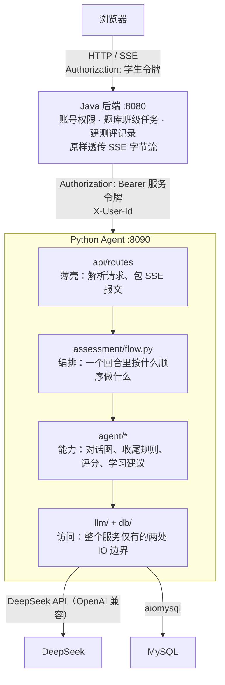

---

## 1. 整体设计：四层，越往里越厚

| 层 | 位置 | 职责 | 判断标准 |
|---|---|---|---|
| 路由层 | `api/routes/` | 解析请求、调用服务、包装响应与 SSE 报文 | 只关心 HTTP |
| 流程层 | `assessment/flow.py` | 编排一个回合：什么时候关题、换题、收尾 | 唯一同时知道「模型 + 引擎 + 数据库」的地方 |
| 能力层 | `agent/*`、`tools/*` | 决策与生成 | 不碰 HTTP，也不碰 SQL |
| 访问层 | `db/*`、`llm/*` | 数据库与模型调用 | 整个服务仅有的 IO 边界 |

配三个「只做形状转换」的邻位文件，让流程层不被细节淹没：

```
assessment/
├── flow.py      只留编排
├── mappers.py   数据库行 → 领域对象（Message / Candidate / 聚合输入）
├── views.py     数据库行 → 接口响应字典（接口长什么样）
└── rubrics.py   题目快照 → 提示词里的评分关注点

domain/
├── schemas.py       HTTP 契约
├── vocabulary.py    考察点 → 维度 的词表镜像（与 Java 侧有测试比对）
├── ability_level.py 等级划档 L0–L5
└── aggregation.py   题目分 → 考察点分 → 维度分 → 综合分
```

一条贯穿全局的原则：**Java 管业务事实，Agent 管测评过程，两者只通过 DB 和 HTTP 单向交互。**

---

## 2. 状态怎么设计

### 2.1 状态是什么

状态就是一张在节点之间传递的**普通字典**（`TypedDict`）。节点读取自己需要的字段、
只返回自己改动的部分，LangGraph 负责把它们合并回去。

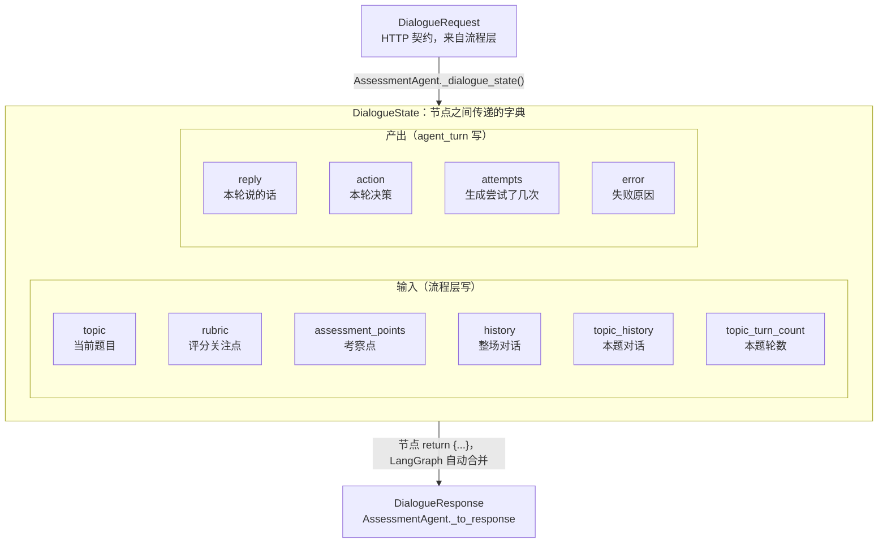

### 2.2 字段清单一览（谁写、谁读）

| 字段 | 谁写 | 谁读 | 说明 |
|---|---|---|---|
| `topic` | 流程层 | 决策轮、发言轮、日志 | 当前题目题干 |
| `rubric` | 流程层（`rubrics.dialogue_rubric`） | 提示词 | 评分关注点 + 参考选项说明 |
| `assessment_points` | 流程层 | 提示词 | 本题考察点 |
| `history` | 流程层 | 提示词 | **整场**对话，跨题保持上下文 |
| `topic_history` | 流程层 | **只有**确定性收尾规则 | 只看本题，避免上一题的话影响本题判定 |
| `topic_turn_count` | 流程层 | **只有**确定性收尾规则 | 本题学生已说几轮，配合 `max_topic_turns` |
| `reply` | `agent_turn` | `_to_response` | 本轮说给学生的话 |
| `action` | `agent_turn` | `_to_response` → 流程层 | `ask_followup` / `next_question` |
| `attempts` | `agent_turn` | 日志、测试 | 生成重试了几次 |
| `error` | `agent_turn` | `_to_response`（reply 为空时用它报错） | 失败原因 |

### 2.3 三条设计约束

1. **输入与产出分开命名**：输入是名词（`topic`），产出是结果（`reply`/`action`）。
   看名字就知道这个字段是喂进来的还是算出来的。
2. **节点不维护任何全局变量**：所有中间结果都在字典里流转，所以同一个 Agent 可以并发处理多个测评。
3. **一个字段只有一个读者**：`topic_history` 只给收尾规则用、`history` 只给提示词用。
   避免"同一个字段在两个地方有不同含义"这种最难查的 bug。

### 2.4 为什么没有 `ScoreState` 了

以前评分也有一份状态（`rubric` / `assessment_points` / `history` 进，`result` 出），
因为那时评分是一张单节点图。现在评分是一次**纯函数调用**（`score_topic(llm, request)`），
请求对象本身就是它的全部输入，没有"节点之间传递"这回事，所以状态定义被删掉了。

> 判断标准：**有节点间流转才需要状态。** 一次进、一次出、没有分支的计算不该有状态。

---

## 3. 工具怎么设计

### 3.1 为什么要用「工具调用」表达决策

模型的输出天然是自由文本。如果让它"用一句话告诉系统该不该换题"，就得从自然语言里猜意思，
必然不稳。工具调用（function calling）把决策变成**结构化的、二选一的**东西。

对比三种做法：

| 做法 | 问题 |
|---|---|
| 让模型输出 JSON 表示决策 | 要防它加解释、加代码块；解析失败就没法继续 |
| 从模型的话里猜（关键词/正则） | 说法无穷多，误判率高 |
| **让模型调工具**（当前做法） | 由接口层强制结构合法，且天然互斥 |

### 3.2 两个工具

整个 Agent 只暴露两个工具，一次只能选一个（定义在 `app/agent/actions.py`）：

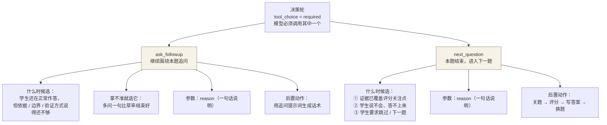

### 3.3 关键约束：工具不改任何状态

工具**只是决策的载体**。`ask_followup` / `next_question` 被调用时不会写数据库、
不会关题、不会换题；真正的后置动作由 `assessment/flow.py` 在发言流完之后统一执行。

这条约束带来的好处：决策（发生在模型侧）和执行（发生在流程侧）彻底解耦，
模型不可能"顺手改状态"，而流程层永远清楚自己下一步要做什么。

### 3.4 `tool_choice="required"` 的含义

它让"模型没做决策"这件事在结构上不可能发生——要么调 `ask_followup`，要么调 `next_question`。

但兜底仍然要有，因为**调用可能失败**（网络异常）或**返回没见过的工具名**：

| 情况 | 处理 |
|---|---|
| 模型没调工具（null） | 按 `ask_followup` 处理 |
| 模型返回了别的工具名 | 按 `ask_followup` 处理 |

方向是刻意选的：**宁多问一句，也不草率结束一个话题。**

### 3.5 怎么加第三个工具

三步，不需要改提示词以外的结构：

1. `app/agent/actions.py` —— 补一个工具定义，加进 `TURN_TOOLS`
2. `app/agent/dialogue.py` —— 在 `_speak()` 里给它配一段发言提示词
3. `app/assessment/flow.py` —— 处理它的后置动作（关题？换题？还是什么都不做）

决策轮会自动把新工具纳入候选——因为它读的就是 `TURN_TOOLS`。

---

## 4. 每轮对话的图怎么设计

### 4.1 现在的图：一个节点

```python
# app/agent/graphs.py
def build_dialogue_graph(llm, settings):
    graph = StateGraph(DialogueState)
    graph.add_node("agent_turn", agent_turn_node(llm, settings))
    graph.add_edge(START, "agent_turn")
    graph.add_edge("agent_turn", END)
    return graph.compile()
```

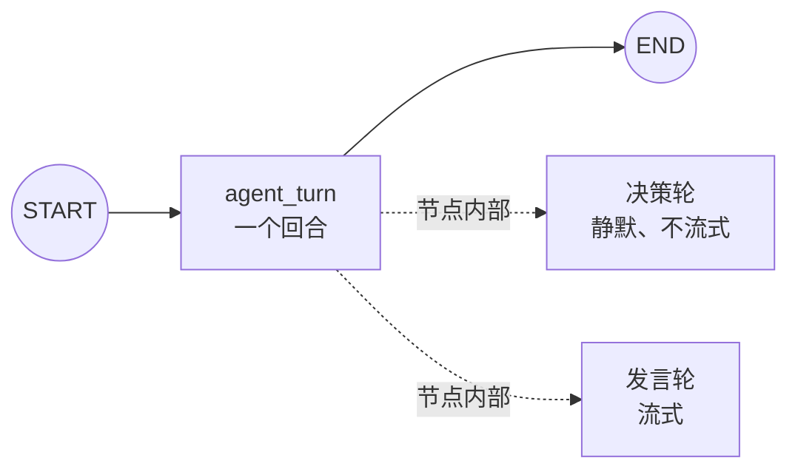

每收到一条学生消息跑一次，跑完就结束——**图本身没有循环**。
学生再说话，就是再跑一次图。

### 4.2 为什么只有一个节点

这是踩过坑才改成的样子。之前是三节点结构：

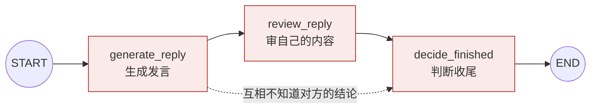

三步各自独立，生成和判断互相不知道对方的结论，于是出现了两类事故：
模型嘴上还在追问、系统却按自己的判断换了题；或者模型嘴上收尾、决策却被当成噪声丢掉，
学生卡住。

现在把「思考 → 调工具 → 说话」整条 ReAct 循环收在**一个节点内部**，
因为它的每一步都要和同一个流式通道打交道：工具调用必须静默、最终发言必须逐字流出去。
放在一个节点里，这两条不变量是**局部可读**的——读一个函数就能确认，不需要跨节点追踪。

### 4.3 节点内部：两次模型调用，顺序固定

这是整个 Agent 最重要的一个设计决定。

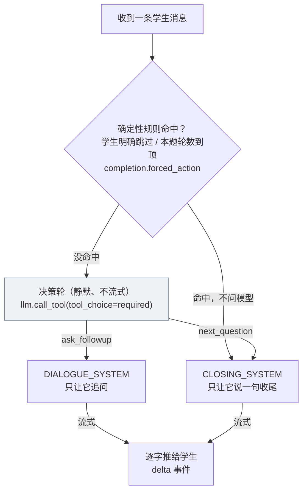

**为什么非要拆成两次调用。** 合在一次里，「说什么」和「做什么」就是同一次响应的两个独立产物，
可以互相矛盾。这个坑踩过两次，两个方向都真实发生过：

1. **嘴上追问、系统却换了题**：模型还在追问，流程层按自己的判断换了下一题，学生同时看到追问和新题；
2. **嘴上收尾、题却关不掉**：模型返回 `next_question` 的同时也带了正文，而正文是边流边发的、
   工具调用要到响应结束才完整；等拿到决策时话已经说出去了，只能把决策丢掉——学生卡在一条
   既不追问、也不出下一题、也不结束的话题里。

拆开之后这类矛盾在结构上不存在：**动作先定下来，话再按动作、用对应的提示词生成。**

**流式不受影响**：决策轮不流式、也不发给前端（前端此时显示"正在思考"），
说给学生听的那句话仍然是逐字推出去的。用户看到的就是"先想，再说话"。

### 4.4 流式是怎么出去的

`agent_turn` 是 LangGraph 节点，节点里通过 `get_stream_writer()` 拿到一个写入器：

```python
writer({"delta": chunk})        # 节点内部
```

外层用 `astream(..., stream_mode=["custom", "values"])` 消费：

| 模式 | 内容 | 用途 |
|---|---|---|
| `custom` | 节点主动写出的 `{"delta": ...}` | 逐字转发给前端 |
| `values` | 跑完后的完整状态 | 取 `reply` / `action` 组装响应 |

**这也是对话图不能删的原因**：`get_stream_writer()` 必须在图节点里才拿得到，
图在这里同时承担了「节点容器」和「流式通道」两个角色。

### 4.5 评分为什么没有图

评分是「一次请求 → 一个结构化结果」，没有节点间流转、没有分支、不需要流式，
所以它既没有状态也没有图，就是 `app/agent/scoring_tool.py` 里的一个函数：

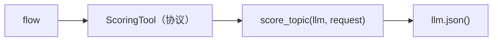

（改造前这里也套了一张单节点图，属于纯转手，已经删掉。）

---

## 5. 提示词怎么设计

所有提示词集中在 `app/agent/prompts.py`。调文案、加约束、改输出格式都只动这一个文件。

### 5.1 六段提示词，按用途分工

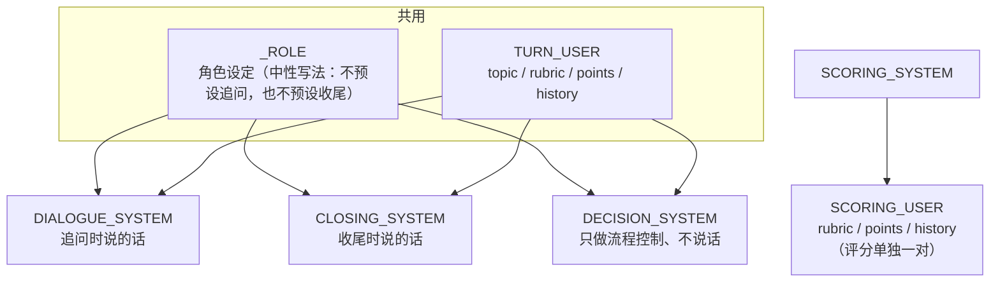

| 常量 | 用途 | 关键约束 |
|---|---|---|
| `_ROLE` | 三条提示词共用的角色设定 | 整场是连续对话；参考选项不是限制；学生有权结束话题；不得泄露评分标准 |
| `DECISION_SYSTEM` | 决策轮：二选一 | 必须调用工具、不要输出文字 |
| `DIALOGUE_SYSTEM` | 发言轮（追问） | 只问最缺的那一点；2–4 句、≤120 字；纯文本 |
| `CLOSING_SYSTEM` | 发言轮（收尾） | 只输出一句收尾；≤40 字；不要追问、不要透露下一题 |
| `TURN_USER` | 三条共用的用户输入 | 主题 / 关注点 / 考察点 / 整场对话 |
| `SCORING_SYSTEM` + `SCORING_USER` | 打分 | 只依据学生消息中的证据；无有效回答直接 0 分；输出 JSON |

**共用而不是各写一份**，是为了避免它们慢慢走样：`_ROLE` 里的角色设定被改一次，
追问和收尾两边同时生效；`TURN_USER` 的输入结构改一次，决策和发言也同时生效。

### 5.2 用 `string.Template` 而不是 f-string

```python
TURN_USER = Template("""当前主题：$topic
当前主题说明与评分关注点：$rubric
当前主题考察点：$points
整场测评完整对话：
$history""")
```

提示词里含 JSON 示例（大量花括号），f-string 和 `.format()` 都会被花括号搞乱，
`$变量` 占位不会和它们打架。

### 5.3 每条约束都是踩过的坑

| 约束 | 不写会怎样 |
|---|---|
| "只输出纯文本，不要 JSON / Markdown / 代码块" | 模型偶尔把回复包成 `{"reply": "..."}`，学生就看到 JSON |
| "2 到 4 句、不超过 120 字" | 模型开始长篇点评，对话节奏被打断 |
| "不要出现考察点、评分标准这类字眼" | 学生提前看到评分口径，测评失效 |
| "不要照抄示例，每次换着说" | 模型逐字复读提示词里的例句，每次跳过都是同一句话 |
| "学生表示不会或要跳过时不要再追问同一个问题" | 学生越不答、模型越追问，把人困在同一题 |
| 学生有权结束任何话题，拒绝不是需要被纠正的行为 | 模型把"学生想跳过"当成"态度问题"，继续施压 |

### 5.4 输出形态的双保险

提示词说了"只输出纯文本"还不够，代码里还有一道防护（`dialogue.py`）：

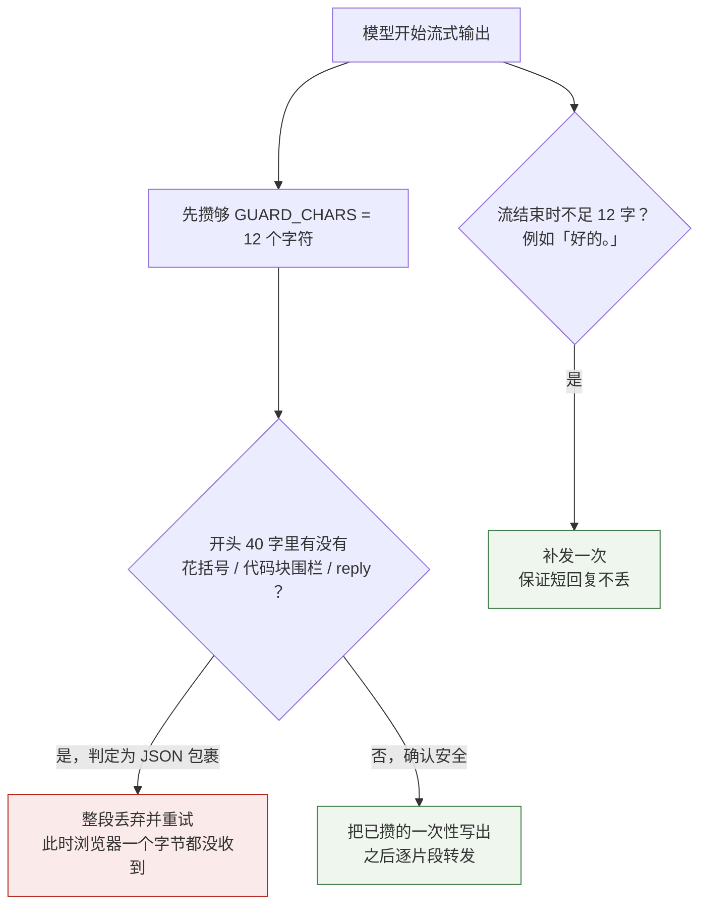

最多重试 `MAX_REPLY_ATTEMPTS = 2` 次。

### 5.5 提示词里不写的东西

- **不写"下一题是什么"**：三条提示词都不提下一题，因为它由出题引擎决定，模型不需要知道；
- **不写评分标准给对话用**：追问提示词里只有"针对最缺的那一点提问"，
  具体评分口径只在 `SCORING_*` 里，避免模型拿评分标准去"教"学生；
- **不写流程控制**：轮到谁说话由代码决定，不靠提示词里的"如果…就…"。

---

## 6. 记忆怎么设计（短期记忆）

### 6.1 一句话：没有轮数窗口

一场测评从第一题到最后一题的**全部对话**都保留，每次模型调用都**全量重放**。
没有 `LIMIT`、没有摘要、没有向量检索。

| 问题 | 答案 |
|---|---|
| 短期记忆有几轮？ | 没有轮数窗口，整场都在 |
| 那 6 是什么？ | 单题**追问轮数上限**（`AGENT_MAX_TOPIC_TURNS`），是收尾阈值，不是记忆窗口 |
| 存在哪？ | MySQL `assessment_messages` |
| 会截断吗？ | 不会。历史越长，每次请求带的 token 越多 |

### 6.2 两层历史，喂给不同的消费者

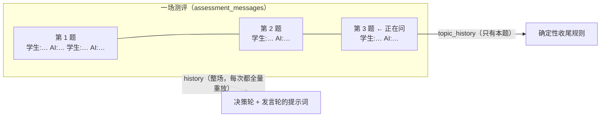

| 用途 | 用哪份 | 为什么 |
|---|---|---|
| 决策轮 / 发言轮 | `history` | 让模型看到整场上下文，保持前后一致 |
| 确定性收尾规则 | `topic_history` | **只看本题**，避免上一题的「下一题」把新主题一起判掉 |
| 单题评分 | 本题消息 | 只按这道题的表现打分 |

两份都是纯文本拼进提示词（`transcript.render_history`），形如 `student: …` / `ai: …`。

### 6.3 长度会长成什么样

以 10 题、每题 3 轮（学生 3 句 + AI 3 句）为例：

| 时点 | `history` 消息数 |
|---|---|
| 第 1 题开场 | 0 → 兜底 1 条（没有历史时用"开始"占位） |
| 第 1 题第 3 轮 | 约 6 条 |
| 第 5 题结束 | 约 30 条（前面几题都还在） |
| 第 10 题结束 | 约 60 条，每轮仍然全量重放 |

### 6.4 写入时机（顺序是刻意的）

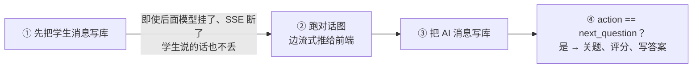

### 6.5 断点恢复

记忆全部落在 MySQL，不在进程内存里，所以 Agent 重启、后端重启都不影响续做：
`GET /internal/v1/assessments/{id}/conversation` 返回整场消息 + 当前题目，前端刷新即可恢复。

### 6.6 代价

1. token 随测评长度线性增长；
2. 一个回合里同一份 `history` 要传两次（决策 + 发言），成本翻倍——
   这是为"决策与发言不矛盾"付出的代价（第 4.3 节）；
3. 出题**不参考**历史对话内容，出题引擎只看候选题目、已用题、考察范围、题量。

---

## 7. 一个回合怎么编排

入口是 `AssessmentFlow.chat(assessment_id, student_user_id, content)`，返回一个 SSE 事件流。

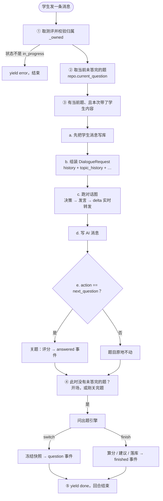

SSE 共六种事件：

| 事件 | 载荷 | 含义 |
|---|---|---|
| `question` | `{id, content, options}` | 出了新题，前端作为一条「题目」插入对话 |
| `delta` | `{text}` | AI 发言的一个片段 |
| `answered` | `{questionId, score, failed}` | 当前题问完并已评分 |
| `finished` | `{assessmentId}` | 整场结束，前端跳结果页 |
| `done` | `{reply}` | 本回合结束 |
| `error` | `{message}` | 流中途失败（由路由层补发） |

典型回合：

| 输入 | 输出事件 |
|---|---|
| 无内容的开场（还没有题） | `question` → `done` |
| 学生回答，模型决定追问 | `delta`… → `done` |
| 学生回答，结束本题且还有下一题 | `delta`…（收尾语）→ `answered` → `question` → `done` |
| 学生回答，结束本题且没有下一题 | `delta`…（收尾语）→ `answered` → `finished` → `done` |

**一次请求里可能同时完成「关旧题 + 开新题 + 收尾整场」**，所以前端不需要推断还有没有下一题，
也不需要额外的"下一题"按钮。

---

## 8. 出题引擎怎么设计

出题引擎（`app/tools/question_selection.py`）是唯一决定「继续问当前题 / 换一道 / 整场结束」的地方，
Java 和前端都不感知它的存在。默认策略 `RandomEngine` 的判断顺序：

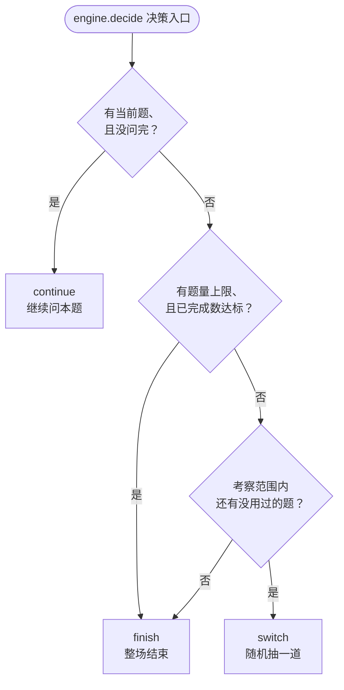

`EngineContext` 是决策所需的全部输入：候选题目、已出过的题、考察范围、当前题及是否问完、
题量上限、已完成数。换策略只改这一个文件（实现带 `decide(context)` 的类后注入）。

两个容易忽略的设计：

- **考察范围筛完为空时退回全量班级题库**（`eligible_candidates`），避免教师选了过窄的范围把测评卡死；
- **随机数用 `random.SystemRandom()`**，不参与全局随机种子。

题量从哪来：教师任务用任务上的题数，自主练习用学生开始测评时选的题量，0 表示不限。

---

## 9. 评分与聚合怎么设计

### 9.1 一次评分 = 一次模型调用

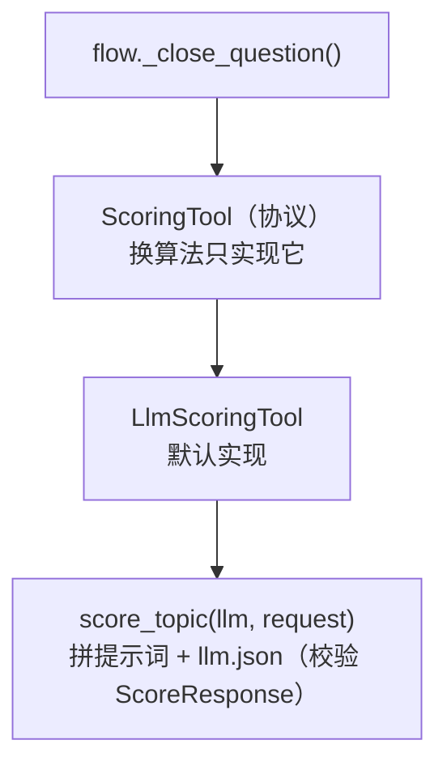

评分口径全部写在提示词里：只依据学生消息中的证据、不因表达风格加分、
学生在本主题没有有效回答就直接 0 分（`reason` 写"学生未作答"）。
**这个 0 分是模型按提示词给出的结论，不是代码兜底伪造的**；模型调用本身失败时，
流程层记 `scoring_failed`、分数留空。

### 9.2 从题目分到能力等级

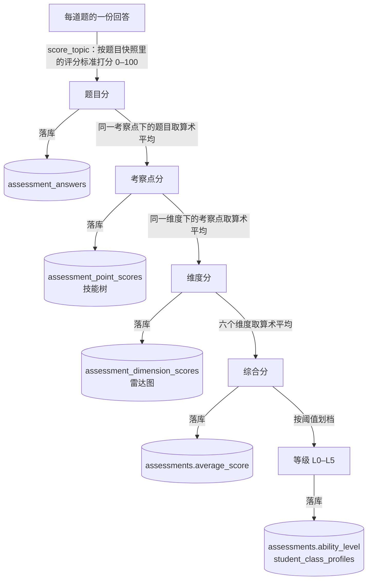

三条规则：

1. **只统计实际出过、且评分成功的题目**；
2. 没考到的维度不参与综合分，不会被当成 0 分；
3. 题的维度归属以**考察点**为准（`domain/vocabulary.py` 的映射），
   对不上词表的旧数据回退到题目的 `tags`，再兜底到「未分类」。

聚合是纯算术、不调模型，代码在 `app/domain/aggregation.py`；等级档位在
`app/domain/ability_level.py`，可用 `ABILITY_LEVELS` 配置覆盖。

### 9.3 学习建议

收尾时与上面同一份聚合结果生成一段文字（`app/agent/advice.py`）：
报出综合分与等级 → 指出最强维度 → 指出薄弱维度并给出提升方向 → 列出该维度下最弱的 1–2 个考察点。
它**不调模型、不会失败**，也同样是可替换的（实现 `AdviceWriter` 协议后注入）。

---

## 10. 失败与兜底怎么设计

贯穿所有分支的一条底线：**宁可报错，也不编造内容、不伪造分数。**

| 场景 | Agent 行为 |
|---|---|
| 服务令牌错误 | 401 |
| 测评不存在 / 不属于该学生 | 404 / 403（流中转为 `error` 事件） |
| 未配置 API Key | 503（`/health` 仍可用并返回 `model_configured: false`） |
| 模型超时、网络异常、非法 JSON | 502（流中为 `error` 事件） |
| **决策轮失败**（网络异常、没调工具、返回没见过的工具名） | 按 `ask_followup` 处理：宁多问一句，也不草率结束话题 |
| **发言轮失败**且动作是 `ask_followup` | 抛 `ModelReplyError`（502 / SSE `error`），**绝不把空话术发给学生** |
| **发言轮失败**且动作是 `next_question` | 用固定兜底话术收尾——本题既然已决定结束，就不能因为一次输出失败把学生卡住 |
| 两次生成都被判定为 JSON 包裹 | 抛错，学生端从未收到脏内容 |
| 评分失败 | 记 `scoring_failed`、分数留空、保留学生原始回答；不进入聚合；整场状态写 `completed_with_scoring_failure` |
| 数据库不可用 | 服务仍能启动，`/health` 可用，测评接口明确报错 |
| 没有可用题目 | 出题引擎返回 `finish`，正常收尾 |

---

## 11. 配置、数据与接口

### 11.1 配置项（`app/core/config.py`，读 `.env` 与环境变量）

| 环境变量 | 默认 | 说明 |
|---|---|---|
| `AGENT_SERVICE_TOKEN` | `change-me` | 服务令牌，必须与 Java 侧一致（生产必须显式配置） |
| `DEEPSEEK_API_KEY` | 空 | 不配则模型接口 503 |
| `DEEPSEEK_BASE_URL` / `DEEPSEEK_MODEL` | `https://api.deepseek.com` / `deepseek-chat` | OpenAI 兼容端点与模型名 |
| `AGENT_TIMEOUT_SECONDS` | `60` | 单次模型调用超时 |
| **`AGENT_MAX_TOPIC_TURNS`** | **`6`** | 单个主题的追问轮数上限（第 6.1 节） |
| `ABILITY_LEVELS` | 空（用内置档位） | 等级划档，「最低分:等级:名称」从高到低 |
| `DB_*` | 本机 root / `ai_assessment` | 直连 MySQL |
| `AGENT_LOG_LEVEL` / `AGENT_LOG_HTTP` | `INFO` / 关闭 | `DEBUG` 看各能力耗时与决策；`HTTP` 才输出底层报文 |

### 11.2 表边界（`app/db/repository.py`）

| 权限 | 表 |
|---|---|
| 只读 | `questions`、`class_questions`、`assessment_tasks` |
| 读写 | `assessments`、`assessment_questions`、`assessment_messages`、`assessment_answers`、`assessment_dimension_scores`、`assessment_point_scores`、`student_class_profiles` |

连接池 `autocommit=True`，**Agent 侧没有跨语句事务**；连不上库时服务仍能启动，
`/health` 可用，测评接口明确报错。

### 11.3 接口

| 方法 | 路径 | 作用 |
|---|---|---|
| GET | `/health` | 存活检查，返回 `model_configured`（免鉴权） |
| GET | `/internal/v1/assessments/{id}/conversation` | 恢复现场：整场对话 + 当前题目 |
| POST | `/internal/v1/assessments/{id}/chat/stream` | 对话（SSE） |
| POST | `/internal/v1/assessments/{id}/complete` | 确认结束：给未答完的当前题补评分后收尾 |
| GET | `/internal/v1/assessments/{id}/result` | 结果：测评 + 逐题 + 维度分 + 考察点分 + 学习建议 |
| POST | `/internal/v1/agent/dialogue` `/dialogue/stream` `/score` | 能力接口，给直连场景与测试用 |

除 `/health` 外都要 `Authorization: Bearer <AGENT_SERVICE_TOKEN>`；学生身份由 Java 校验后
通过 `X-User-Id` 传入，Agent 只做一次归属校验。**前端目前不主动调用 `complete`**——
「退出，稍后继续」只退出页面，收尾统一由 Agent 在题目答完或达到题量时自动触发。

### 11.4 测试

全部离线运行，共 **96 个用例**（`tests/support.py` 提供假模型与假仓库）。

| 文件 | 用例 | 覆盖 |
|---|---|---|
| `test_flow.py` | 19 | 回合事件序列、关题时机、题量回退、收尾落库、建议与画像、结果结构 |
| `test_completion.py` | 15 | 跳过词表、长度上限与轮次上限 |
| `test_llm_client.py` | 14 | JSON 抠取、重试、超时 |
| `test_dialogue.py` | 11 | 决策静默、按动作选提示词、JSON 防护、短回复补发、降级 |
| `test_question_selection.py` | 9 | 不越候选集、不重复、随机性、策略可注入、范围回退 |
| `test_scoring_tool.py` | 9 | 聚合口径、等级划档、评分工具可替换 |
| `test_vocabulary.py` | 5 | **与 Java 侧词表逐条比对** |
| `test_routes.py` / `test_agent.py` | 5 / 4 | HTTP 契约与 SSE 帧格式、门面翻译 |
| `test_scoring.py` / `test_graphs.py` | 3 / 2 | 评分算法与提示词、对话图结构 |

```bash
cd agent-python && ./.venv/bin/python -m pytest tests -q
```

### 11.5 扩展点

| 想做的事 | 改哪里 |
|---|---|
| 换出题策略（覆盖优先、难度曲线） | `app/tools/question_selection.py` |
| **换评分算法**（客观题判分、加权） | `app/agent/scoring_tool.py`，实现 `ScoringTool` 后注入 |
| 换学习建议生成方式 | `app/agent/advice.py`，实现 `AdviceWriter` 后注入 |
| 改聚合口径 / 等级档位 | `app/domain/aggregation.py`、`app/domain/ability_level.py` |
| 改一个回合的行为 / 增删 SSE 事件 | `app/assessment/flow.py`（Java 侧无需改动） |
| 改接口返回字段 | `app/assessment/views.py` |
| 改题目快照怎么变成提示词 | `app/assessment/rubrics.py` |
| 改历史怎么喂给模型（截断、摘要） | `app/agent/transcript.py` + `flow.py` 的 `_dialogue_request()` |
| 加一个新动作 | `agent/actions.py` → `dialogue.py` 的 `_speak()` → `flow.py` 后置动作 |
| 换模型或厂商 | `app/llm/client.py` |
| 改词表 | Java 的 `AiDimension` / `AiAssessmentPoint` + `app/domain/vocabulary.py` |

### 11.6 已知限制

1. **短期记忆没有窗口**：整场对话每次全量重放，长测评 token 开销线性增长；
2. **一个回合发两次同样的历史**：为"决策与发言不矛盾"付出的代价（第 4.3 节）；
3. **出题默认纯随机**：不参考考察点覆盖、难度曲线与历史对话；
4. **确定性跳过识别依赖硬编码词表**：只覆盖中文常见说法，超过 40 字的消息即使含"跳过"也不触发；
5. **没有跨语句事务**、**没有并发控制**：同一测评并发两路会各跑完各自流程；
6. **`/health` 只反映 Key 是否配置**，不探测 DeepSeek 是否真的可达；
7. **题型不影响处理方式**：所有题都当带参考选项的开放式话题交模型评分，
   没有客观题精确判分（入口已留在 `ScoringTool`，待实现）。

---

---

---
