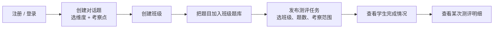
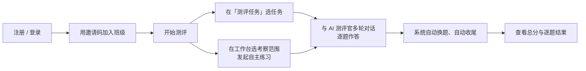
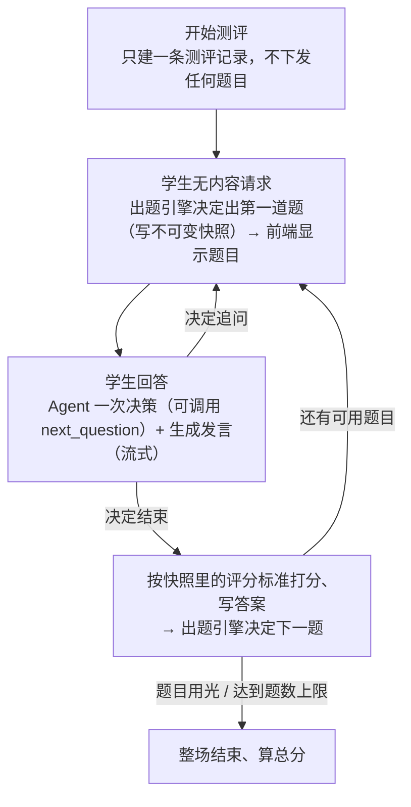

# AI 能力测评系统 · 整体功能文档

> 文档口径：**只描述当前代码已经实现的功能**，不描述规划。所有结论都能在
> `backend-java/`、`agent-python/`、`frontend-ai-assessment/` 三个工程里找到对应实现。

## 1. 系统定位

这是一个**以对话为主要形式的 AI 使用能力测评系统**。它不是一张试卷，而是一场由 AI
测评官主导的连续对话：学生每说一段，AI 决定是继续追问、换下一个主题还是收尾，并在
每个主题结束时按评分标准打分，最后给出本次测评的总分和逐题结果。

三种角色，两套界面：

| 角色 | 入口 | 能做什么 |
|---|---|---|
| 学生 | 学生端 | 加入班级、参加教师布置的测评任务、发起自主练习测评、查看自己的测评记录与结果 |
| 教师 | 教师端 | 管理对话题库、创建班级与邀请码、管理班级成员和班级题库、发布测评任务、查看学生完成情况与测评明细 |
| 系统 | 无界面 | Java 后端负责账号/权限/题目/班级/任务，Python Agent 负责测评过程（出题、追问、评分、收尾） |

第一版没有管理员端、企业端、训练场、积分排行榜和长期能力画像。

## 2. 端到端主流程

教师侧：



学生侧：



一次测评内部的循环：



## 3. 功能模块

### 3.1 账号与认证

| 功能 | 角色 | 实现要点 |
|---|---|---|
| 学生注册 / 教师注册 | 未登录 | 先写 `users`，再写 `students` / `teachers` 关联；账号全局唯一；密码 BCrypt 存储；拒绝中文密码 |
| 分端登录 | 学生 / 教师 | 请求体带 `role`，登录时校验该账号是否具备对应角色，没有则提示「当前账号暂无学生/教师身份」 |
| 退出登录 | 已登录 | Sa-Token 注销，登录态存 Redis，后端重启不掉线 |
| 当前用户 | 已登录 | `GET /api/users/me` |
| 修改资料 | 已登录 | 只能改姓名、昵称和密码（改密码需校验旧密码） |

登录令牌放在 `Authorization` 请求头里，**值就是 token 本身，不带 `Bearer` 前缀**。
所有 `/api/**` 接口默认要求登录，只有 `/api/auth/**` 和 CORS 预检放行。

### 3.2 题库管理

| 功能 | 角色 | 实现要点 |
|---|---|---|
| 创建题目 | 教师 | 题型为对话题 / 单选题 / 判断题；维度可多选，考察点至少 1 个且必须属于所选维度之一；对话题必须填评分标准 |
| 我的题库 | 教师 | 只返回自己创建的、未下线的题目 |
| 编辑题目 | 题目拥有者 | 校验归属后整体更新 |
| 公开 / 转私有 | 题目拥有者 | 更新 `visibility`；公开题库只展示 `public + active` |
| 下线 / 恢复 | 题目拥有者 | 更新 `status`；下线是状态变更，不删数据 |
| 浏览公开题库 | 已登录用户 | `GET /api/questions/public` + `GET /api/questions/{id}` |
| 深拷贝公开题 | 已登录用户 | 复制成一个新的私有副本，归属调用者 |
| 加入 / 移除班级题库 | 教师 | 只能加入自己拥有的、未下线的题目；移除只改状态 |
| 固定分类词表 | 已登录用户 | `GET /api/questions/taxonomy` 返回「维度 → 该维度考察点（含介绍）」，共 6 维度 / 20 考察点；前端只能点选 |

### 3.3 班级管理

| 功能 | 角色 | 实现要点 |
|---|---|---|
| 创建班级 | 教师 | 创建时自动生成 6 位数字邀请码 |
| 刷新邀请码 | 教师（班级拥有者） | 旧码立即置为 `invalidated`，新码生效；已加入成员不受影响 |
| 加入班级 | 学生 | 按**有效邀请码**匹配班级；重复加入会被拒绝；退出后可重新加入 |
| 退出班级 | 学生 | 成员状态置 `left` |
| 移出成员 | 教师（班级拥有者） | 成员状态置 `removed` |
| 班级详情 | 教师 / 班级成员 | 返回班级、成员数、班级题目数、当前邀请码 |
| 成员列表 / 班级题库 | 教师（班级拥有者） | — |

### 3.4 测评任务（教师布置）

| 功能 | 角色 | 实现要点 |
|---|---|---|
| 发布任务 | 教师（班级拥有者） | 需填标题、题数（默认 10，最小 1）；**发布时校验班级题库题目数不少于题数**；可指定考察范围（维度 / 考察点），不选表示不限 |
| 班级任务列表 | 教师 / 班级成员 | 只返回 `active` 任务 |
| 可参加任务 | 学生 | 汇总自己所有已加入班级的 `active` 任务 |
| 任务详情 | 教师（任务拥有者）/ 班级成员 | 返回任务与所属班级 |
| 开始任务测评 | 学生（班级有效成员） | **同一任务一人一次**：进行中的记录直接复用（断点续做，幂等）；**已完成的拒绝再次参加**（返回 409）；新建时把任务的考察范围原样复制到测评上 |
| 任务状态展示 | 学生 | 任务列表区分「未开始 / 进行中 / 已完成」：未开始可「开始测评」，进行中可「继续测评」，已完成只能「查看报告」 |

### 3.5 测评过程（核心）

这是系统中唯一由 Python Agent 主导的部分。Java 只做两件事：建测评记录、把请求原样转发。

| 功能 | 角色 | 实现要点 |
|---|---|---|
| 自主练习测评 | 学生（班级有效成员） | 每次都是全新测评；可选考察范围（维度 / 考察点），不选表示不限；可重复发起 |
| 出题 | 系统 | 由 `QuestionEngine` 在班级题库里挑一道没用过的题，写不可变快照后下发 |
| 对话追问 | 学生 / 系统 | 一个请求一个回合，SSE 流式返回 AI 发言 |
| 判断收尾 | 系统 | 模型在对话里自主判断（调用 `next_question` 工具表达）；学生明确要求跳过或轮次到上限时由确定性规则强制收尾 |
| 单题评分 | 系统 | 题目结束时按**快照里的**评分标准让模型打分（0–100） |
| 自动换题 / 自动结束 | 系统 | 题目用光或达到任务题数上限时结束整场并计算总分 |
| 中途退出（不结束） | 学生 | 「退出，稍后继续」按钮：只退出页面，测评保持 `in_progress`，之后从「测评任务」或「测评记录」点「继续测评」回来 |
| 收尾 | 系统 | 题目用光或达到题量上限时由 Agent 自动收尾；`POST /api/assessments/{id}/complete` 仍保留（会先给未答完的当前题补评分），前端不再主动调用 |
| 断点恢复 | 学生 | 刷新页面用 `GET /api/assessments/{id}/conversation` 拉回整场对话与当前题目 |

### 3.6 结果与查看

| 功能 | 角色 | 实现要点 |
|---|---|---|
| 测评记录列表 | 学生 | 按创建时间倒序，含进行中与已完成 |
| 我的测评结果 | 学生 | 总分、逐题快照、逐题得分、评分理由与证据、是否存在评分失败 |
| 测评状态 | 学生 | 单条查询测评基础信息 |
| 任务完成情况 | 教师（任务拥有者） | 按任务列出所有学生的测评汇总（状态、总分、已完成题数、是否评分失败） |
| 班级完成情况 | 教师（班级拥有者） | 按班级汇总该班级所有任务的测评 |
| 测评明细 | 教师（任务拥有者） | 学生信息 + 每道题的题干快照、完整对话消息、答案与评分结果 |

## 4. 核心业务规则

1. **维度与考察点是受控词表。** 6 个维度、20 个考察点，前端只能点选。出题、发布任务、开始自主测评三处共用同一份校验（`AiTaxonomy`）。
2. **一道题可以属于多个维度**，考察点必须来自所选维度之一。「AI工具使用」维度下的 8 个使用场景（文本写作 / 图像生成 / 视频制作 / 音频处理 / 设计辅助 / 办公与写作 / 编程开发 / 数据分析与商业智能）**不作为考察点**：它们的名字与描述已并入所属考察点的介绍，词表第二级就是 4 个考察点。
3. **考察范围为空 = 不限制。** 学生开始任务时继承任务上的范围；自主测评由学生自己选。范围筛选后一道题都没有时，出题引擎会退回全量班级题库，避免把测评卡死。
4. **同一道题在同一测评中只会出现一次**，由「出题引擎排除已用题」+ 数据库唯一键 `(assessment_id, question_id)` 双重保证。
5. **题目快照不可变。** 发题时把题干、选项、标准答案、评分标准、难度、维度、考察点全部冻结进 `assessment_questions`，之后教师改题库不影响进行中或历史测评。
6. **同一任务一个学生只有一次测评**：进行中可继续，完成后不能再进入（接口返回 409，页面只提供「查看报告」）；自主练习测评每次都是新的，不限次数。
7. **任务长期有效**：不支持截止时间、关闭、撤回、补测。
8. **评分失败不伪造分数。** 模型调用失败时该题记为 `scoring_failed`，分数留空，同时保留学生原始回答；整场总分会被标记为「包含评分失败题目」。
9. **总分 = 已评出分数题目的算术平均**（保留两位小数）；一道题都没评出分数时总分留空。
10. **软删除优先。** 成员退出/被移出、题目下线、题目移出班级题库都是改状态，历史测评始终可复核。
11. **Java 不解析测评过程。** AI 说了什么、要不要换题、有没有下一题，全部由 Agent 决定；Java 只是把 SSE 字节流透传给浏览器。
12. **能力分数分三层：考察点是技能树的叶子，维度是雷达图的单位。** 考察点分 = 该考察点下所有已评分题目的算术平均；维度分 = 该维度下所有已考察点的算术平均；综合分 = 维度分的算术平均（没考到的维度不参与）；能力等级由综合分划档（L0–L5，阈值可配）。评分失败与未考察的维度都不进聚合，不伪造 0 分。
13. **所有分数按班级隔离。** 同一个学生在不同班级的分数、等级、技能树、趋势互不影响；查询一律带 `class_id`，只取该班级下最新一次已完成的测评。

## 5. 维度与考察点词表

词表定义在 `backend-java/src/main/java/com/huiqiyikang/assessment/domain/`，共 6 个维度 20 个考察点，每个考察点带一段由《具体考察点2.0》整理来的介绍（`description`），既用于「AI 能力标准」页，也作为实操任务的评分参考得分点。

| 维度 | 考察点 |
|---|---|
| AI基础认知 | AI基本概念理解、数据影响AI输出的认知、AI决策的基本逻辑、AI发展历程认知、AI能力边界认知、AI社会影响认知、批判性看待AI |
| 提示词工程 | 提示词书写 |
| AI工具使用 | 工具选型及局限性认知、工具使用能力、工作流整合、智能体编排（前两个的介绍里按场景分行列出了 8 个使用场景） |
| AI结果评估与优化 | 评估AI结果、优化AI结果 |
| 人机协同解决问题 | 与AI协作解决问题 |
| AI伦理与合规 | 隐私保护意识、合规意识、偏见及有害内容识别、版权与知识产权认知、问责意识 |

词表以中文名落库（不是枚举名），保证历史数据和导出结果可读。

## 6. 状态与枚举

| 对象 | 字段 | 取值 |
|---|---|---|
| 题目 | `visibility` | `private` / `public` |
| 题目 | `status` | `active` / `offline` |
| 班级成员 | `status` | `active` / `left` / `removed` |
| 邀请码 | `status` | `active` / `invalidated` |
| 测评任务 | `status` | `active`（当前只使用这一个值） |
| 测评 | `status` | `in_progress` → `completed` 或 `completed_with_scoring_failure` |
| 发题快照 | `status` | `sent` → `answered`，另有 `finished` 布尔 |
| 答案 | `result_status` | `scored` / `scoring_failed` |
| 对话消息 | `sender_type` | `student` / `ai` |

## 7. 接口清单

### 7.1 Java 对外接口（前缀 `/api`）

认证与账号：

```
POST   /api/auth/register/student
POST   /api/auth/register/teacher
POST   /api/auth/login
POST   /api/auth/logout
GET    /api/users/me
PUT    /api/users/me
PUT    /api/users/password
```

题库：

```
GET    /api/questions
GET    /api/questions/public
GET    /api/questions/taxonomy
POST   /api/questions
GET    /api/questions/{id}
PUT    /api/questions/{id}
POST   /api/questions/{id}/publish
POST   /api/questions/{id}/unpublish
POST   /api/questions/{id}/offline
POST   /api/questions/{id}/restore
POST   /api/questions/public/{id}/copy
```

班级：

```
POST   /api/classes
GET    /api/classes/managed
GET    /api/classes/joined
GET    /api/classes/{id}
POST   /api/classes/join
DELETE /api/classes/{id}/leave
GET    /api/classes/{id}/members
DELETE /api/classes/{id}/members/{studentId}
POST   /api/classes/{id}/invite-code
GET    /api/classes/{id}/questions
POST   /api/classes/{id}/questions/{questionId}
DELETE /api/classes/{id}/questions/{questionId}
```

任务与测评：

```
POST   /api/classes/{classId}/assessment-tasks
GET    /api/classes/{classId}/assessment-tasks
GET    /api/assessment-tasks/available
GET    /api/assessment-tasks/{id}
POST   /api/assessment-tasks/{taskId}/start
POST   /api/classes/{classId}/self-assessments/start
GET    /api/assessments
GET    /api/assessments?classId={classId}       # 按班级过滤测评记录
GET    /api/assessments/{id}
GET    /api/assessments/{id}/conversation
POST   /api/assessments/{id}/chat/stream        # SSE
POST   /api/assessments/{id}/complete
GET    /api/assessments/{id}/result
```

能力数据（班级隔离，一次返回雷达图/技能树/趋势/上一次对比的数据）：

```
GET    /api/classes/{classId}/my-ability
```

教师查看结果：

```
GET    /api/teacher/assessment-tasks/{taskId}/results
GET    /api/teacher/classes/{classId}/results
GET    /api/teacher/assessments/{id}
```

响应统一为 `{ "code": 0, "message": "success", "data": ... }`，失败时 `code` 等于 HTTP 状态码，
`message` 可直接展示给用户。所有 `Long` 类型在 JSON 里被序列化成**字符串**，避免超出
JavaScript 安全整数范围导致前端 ID 失真。

需要注意：**测评过程那几个由 Python 直接返回的接口**（`conversation` / `result`，以及其他
已在 `assessmentApi` 里声明的方法）里的 ID 是普通数字，不经过 Java 的序列化规则。

### 7.2 Python Agent 内部接口

除 `/health` 外都需要 `Authorization: Bearer <AGENT_SERVICE_TOKEN>`，并且**只允许 Java 调用**，
前端不直接访问。

```
GET    /health                                          # 免鉴权，返回模型是否已配置
POST   /internal/v1/agent/dialogue                      # 非流式一问一答
POST   /internal/v1/agent/dialogue/stream               # 流式一问一答
POST   /internal/v1/agent/score                         # 按评分标准打分
GET    /internal/v1/assessments/{id}/conversation       # 恢复现场
POST   /internal/v1/assessments/{id}/chat/stream        # 测评对话（SSE）
POST   /internal/v1/assessments/{id}/complete           # 确认结束
GET    /internal/v1/assessments/{id}/result             # 获取结果
```

学生身份由 Java 校验后用 `X-User-Id` 请求头传给 Agent，Agent 不重复验登录态。

### 7.3 测评 SSE 事件

`/api/assessments/{id}/chat/stream` 是测评中唯一的对话接口。事件帧格式为
`event: <name>\ndata: <json>\n\n`，一共六种：

| 事件 | 载荷 | 含义 |
|---|---|---|
| `question` | `{id, content, options}` | 出题引擎出了新题，前端把它作为一条「题目」插入对话 |
| `delta` | `{text}` | AI 发言的一个片段，前端追加渲染 |
| `answered` | `{questionId, score, failed}` | 当前题问完并已评分，前端把对应题目标记为「已答完」 |
| `finished` | `{assessmentId}` | 整场测评结束，前端跳转结果页 |
| `done` | `{reply}` | 本回合结束（前端当前不处理） |
| `error` | `{message}` | 流中途失败，前端提示用户 |

一个回合可以同时包含多种事件，例如「AI 说完 → 本题答完 → 直接出下一题 → 回合结束」，
顺序依次是 `delta`… → `answered` → `question` → `done`。

## 8. 当前范围之外

| 暂缓功能 | 说明 |
|---|---|
| 实操题、文件上传、产物空间 | 未实现 |
| 长期能力画像、六维雷达图、等级、置信度、积分 | 未实现，只有本次测评的总分与逐题得分 |
| 训练场、排行榜、通知 | 未实现 |
| 管理员端、企业端、跨教师协同 | 未实现，教师可直接公开题目 |
| 任务截止、关闭、撤回、补测、重复参加 | 未实现，任务长期有效且一人一次 |
| 教师人工补录评分 | 未实现，评分失败只做标记 |

## 9. 需要注意的实现细节

这几条是「代码确实这么做」的行为，容易被想当然的预期带偏：

1. **题型目前只影响表单，不影响测评行为。** 题库支持对话题、单选题、判断题，但测评流程把所有题都当作「带参考选项的开放式话题」处理，由模型按评分标准打分，**没有客观题的精确匹配判分**。客观题若没填评分标准，系统会用「参考选项 + 标准答案」自动拼一段评分说明。
2. **自主练习测评没有题数上限**，一直出到班级题库里没有没用过的题为止；教师任务才有题数上限。
3. **中途退出不会锁任务。** 学生点「退出，稍后继续」时前端不调用收尾接口，测评保持进行中，随时可以继续；只有 Agent 在题目答完/题量达到时自动收尾，才会置为已完成。`complete` 接口仍保留，调用时会给未答完的当前题补评分后再收尾。
4. **权限失败返回 400 而不是 403。** 业务异常统一走 `BusinessException`，默认 HTTP 状态是 400，只有少数显式传入的状态码例外。
5. **公开题目的浏览和复制没有角色限制**，任何已登录用户都可以操作。

## 10. 相关文档

- 模块划分、数据模型、部署与配置：[模块设计架构文档](./模块设计架构文档.md)
- Agent 内部设计、图结构、提示词与扩展方式：[Agent设计文档](./Agent设计文档.md)
