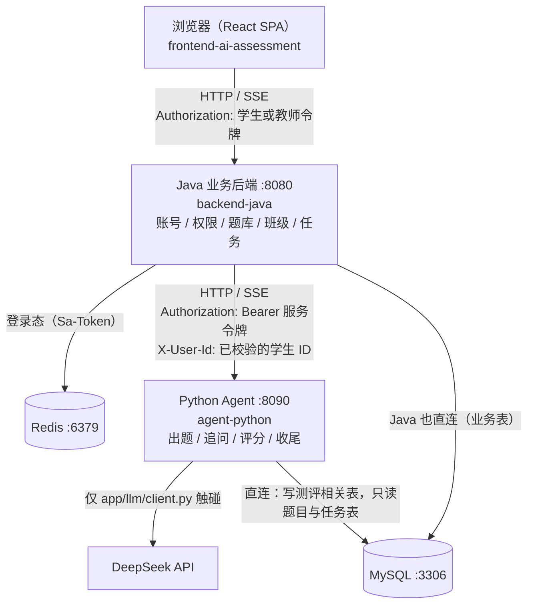
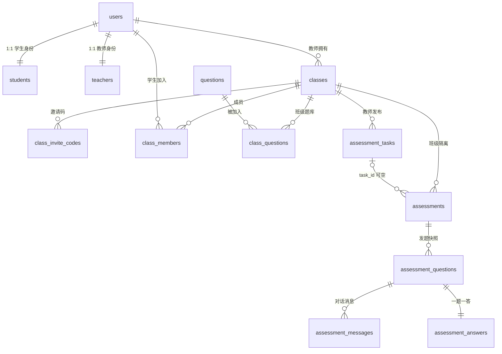
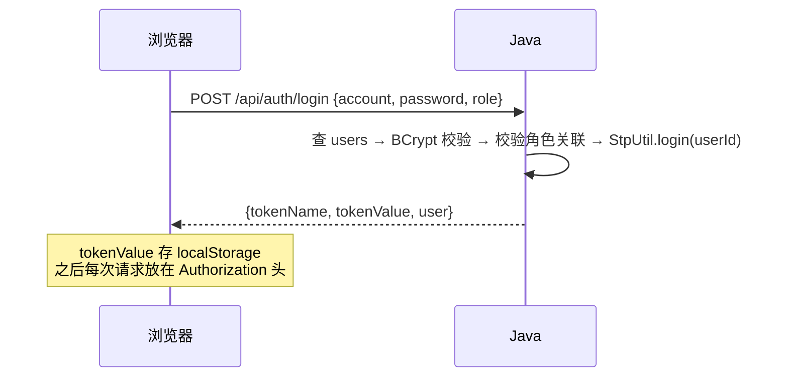
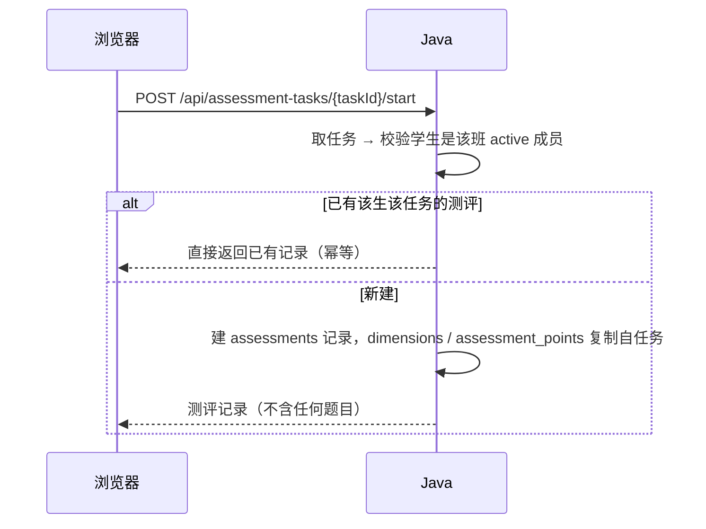
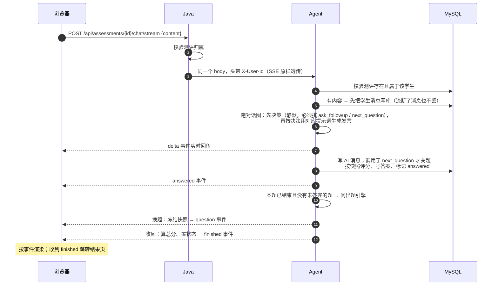
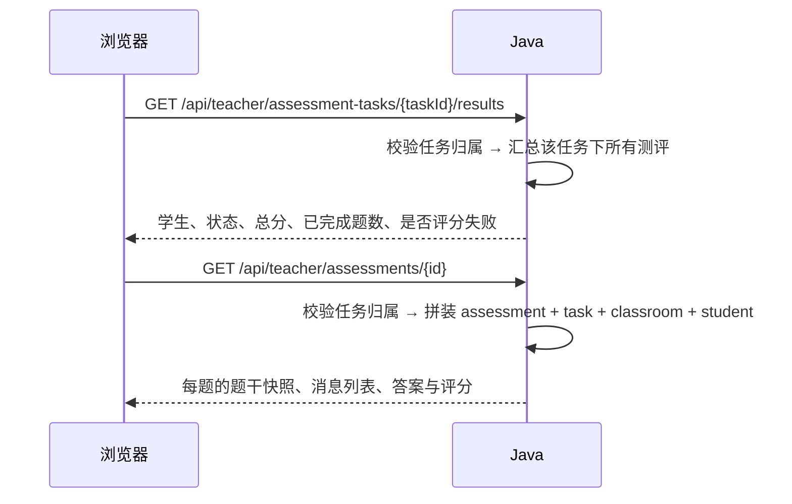

# AI 能力测评系统 · 模块设计与架构文档

> 本文档描述当前代码的模块划分、数据模型、运行方式和关键设计取舍，供二次开发和联调参考。
> 功能层面的说明见 [整体功能文档](./整体功能文档.md)，Agent 内部细节见 [Agent设计文档](./Agent设计文档.md)。

## 1. 总体架构

系统由三个可独立部署的进程 + 三个外部依赖组成：



一条核心原则贯穿全局：**Java 管业务事实，Agent 管测评过程。**

| 事项 | Java 后端 | Python Agent |
|---|---|---|
| 注册、登录、令牌 | ✅ | ❌ 不接收学生令牌 |
| 权限、归属校验 | ✅ | ❌ 信任 Java 传来的 `X-User-Id` |
| 题库、班级、任务增删改 | ✅ | ❌ |
| 建测评记录、复制考察范围 | ✅ | ❌ |
| 出题、判断换题、追问、评分、收尾 | ❌ | ✅ |
| 写发题快照、对话记忆、评分结果 | ❌ | ✅ 直连 MySQL |
| SSE 报文解析 | ❌ 原样透传字节流 | ✅ 决定事件内容 |

## 2. 技术栈

| 工程 | 关键技术 | 版本 |
|---|---|---|
| frontend-ai-assessment | React、Vite、lucide-react | React 19、Vite 8 |
| backend-java | Spring Boot、Spring Web、MyBatis-Plus、Sa-Token、Redis、BCrypt、JDK `HttpClient` | Boot 3.4.5、Java 21、MyBatis-Plus 3.5.12、Sa-Token 1.39.0 |
| agent-python | FastAPI、LangGraph、openai SDK、aiomysql、Pydantic | Python 3.12，依赖见 `requirements.txt` |
| 数据 | MySQL 8 | 事实源 |
| 缓存 | Redis 7 | 登录态（Sa-Token 持久化） |
| 模型 | DeepSeek（OpenAI 兼容协议） | `deepseek-chat` |

关于「用了什么、没用什么」的几个刻意选择：

- **Java 侧引入 Spring Security 只是为了 `BCryptPasswordEncoder`**：`SecurityConfig` 里的过滤器链放行所有请求，真正的登录校验由 Sa-Token 拦截器完成。
- **Java 侧调 Agent 用的是 JDK 自带 `java.net.http.HttpClient`**，不是 WebClient。`pom.xml` 里的 `spring-boot-starter-webflux` 目前没有被引用，属于冗余依赖。
- **Python 侧只把 LangGraph 当作状态机用**：没有使用 LangChain 的 chain / prompt template / output parser，提示词就是普通字符串，结构化输出就是「抠 JSON + Pydantic 校验」。`langchain-core` 只是 LangGraph 的传递依赖，代码中零引用。

## 3. 模块划分

### 3.1 前端 `frontend-ai-assessment`

```
src/
├── main.jsx                     # 挂载 + 顶层错误边界
├── app/
│   ├── App.jsx                  # 屏幕状态机：landing / login / register / 各业务页
│   ├── navigation.js            # 按角色定义侧边栏菜单
│   ├── storage.js               # localStorage 读写：令牌、用户、角色、当前测评、当前班级
│   └── ime.js                   # 输入法组字判定，避免中文回车误提交
├── services/api.js              # 唯一的数据访问层：REST 封装 + SSE 解析 + 401 自动登出
├── components/
│   ├── common.jsx               # Field / PageTitle / Stat / Empty 等基础组件
│   └── layout/                  # Landing（首页）、Shell（登录后外壳 + 侧边栏 + Toast）
└── pages/
    ├── auth/AuthPage.jsx        # 登录 / 注册
    ├── dashboard/               # 学生工作台、教师工作台
    ├── student/                 # 我的班级、测评任务、测评记录
    ├── teacher/                 # 题库管理、班级管理、任务发布与结果查看
    ├── assessment/              # 测评对话页、结果页
    └── account/                 # 个人中心
```

设计要点：

- **没有引入路由库**，`App.jsx` 用一个 `screen` 字符串切换页面，`Shell` 提供侧边栏与页面容器。
- **`services/api.js` 是唯一出口**，组件不直接 `fetch`。401 会清空会话并刷新页面。
- **SSE 手写解析**：`assessmentApi.chat()` 读取 `response.body` 的流，按 `\n\n` 切分事件块，解析 `event:` 与 `data:` 两行后回调业务组件。
- **测评页的状态全部来自后端事件**：`question` 插入题目、`delta` 追加文字、`answered` 标记答完、`finished` 跳转结果页；前端不推断「第几题」「还有没有下一题」。
- 会话信息存 `localStorage`，键为 `assessment_token` / `assessment_user` / `assessment_role` / `current_assessment` / `selected_class`。

### 3.2 Java 后端 `backend-java`

```
com.huiqiyikang.assessment
├── AssessmentApplication.java   # Spring Boot 入口，@MapperScan
├── auth/                        # AuthInterceptor（Sa-Token 校验）、SecurityConfig（BCrypt + 放行）
├── config/                      # WebConfig（CORS + 拦截器注册）、JacksonConfig（Long → String）
├── common/                      # ApiResponse、BusinessException、ApiExceptionHandler
├── controller/                  # 8 个 Controller，HTTP 边界
├── service/                     # 6 个 Service，业务编排与越权判定
├── mapper/                      # MyBatis-Plus Mapper，统一继承 BaseMapperX
├── entity/                      # 13 个实体，与表一一对应
├── domain/                      # AiDimension / AiAssessmentPoint / AiTaxonomy 固定词表
└── manager/AssessmentSessionCache.java   # 预留的 Redis 会话加速（当前未被调用）
```

各 Controller 的职责边界：

| Controller | 覆盖范围 |
|---|---|
| `AuthController` | 注册、登录、退出 |
| `UserController` | 当前用户、资料、改密码 |
| `QuestionController` | 题库 CRUD、公开/下线/恢复、深拷贝、固定词表 |
| `ClassRoomController` | 班级、邀请码、成员、班级题库 |
| `AssessmentTaskController` | 发布任务、班级任务列表、可参加任务、开始任务测评 |
| `AssessmentTaskDetailController` | 任务详情（任务 + 班级） |
| `AssessmentController` | 自主测评、测评查询、**转发测评过程到 Agent** |
| `TeacherAssessmentController` | 教师侧结果汇总与测评明细 |

设计要点：

- **Controller 承担校验与权限**，Service 只做数据编排（`AssessmentService` 里保留了同一方法的新旧两个别名，属于历史演进痕迹）。
- **`BaseMapperX`** 统一了 `findById` / `findAll` / `save`（按 id 是否为空自动选择 insert 或 updateById），屏蔽 MyBatis-Plus 细节。
- **`AiTaxonomy` 是唯一的词表校验入口**，出题、发布任务、开始自主测评三处共用。
- **`AiConversationService` 是 Java 与 Agent 之间唯一的边界**，用 JDK 自带 `HttpClient`（HTTP/1.1）实现；`forwardStream()` 只做 `InputStream.transferTo(OutputStream)`，不解析内容。
- **`JacksonConfig` 把所有 `Long` 序列化为字符串**，避免雪花/自增 ID 超出 JavaScript 安全整数范围；这也是前端拿到 `id` 后与本地字符串比较仍然成立的原因。

### 3.3 Python Agent `agent-python`

```
app/
├── api/
│   ├── main.py            # FastAPI 装配 + lifespan（建连数据库、创建 Agent 与 Flow）
│   ├── dependencies.py    # 服务令牌校验、从 app.state 取实例
│   └── routes/            # health、agent（3 个能力接口）、assessments（4 个测评接口）
├── assessment/flow.py     # 测评流程编排：回合、SSE 事件、评分关题、收尾算分
├── agent/                 # Agent 本体：门面、图、状态、节点、提示词、转写
├── tools/question_selection.py  # 出题引擎（策略可整体替换）
├── llm/client.py          # 唯一接触模型厂商的文件
├── db/                    # 连接池 + 测评相关读写
├── domain/schemas.py      # HTTP 契约的 Pydantic 模型
└── core/                  # 配置与异常
```

四层，从上到下依次变厚：

1. **路由层**（`api/routes`）只解析请求、调用服务、包装响应和 SSE 报文。
2. **流程层**（`assessment/flow.py`）决定一个回合里发生什么。
3. **能力层**（`agent/*`、`tools/*`）真正调模型和做决策。
4. **访问层**（`db/*`、`llm/*`）接触外部系统，是整个服务里仅有的 IO 边界。

## 4. 关键设计决策

| 决策 | 理由 |
|---|---|
| 测评过程整体放在 Python，而不是放在 Java 调模型 | 出题、追问、评分是一个带状态机的多轮循环，用 LangGraph 表达比在 Java 里拼条件分支更清晰；换策略只动 Python |
| Agent 直连 MySQL，而不是回调 Java 接口 | 避免 Java 与 Python 之间来回回调造成的分布式事务和时序问题；Token 交互只保留「Java 转发请求 → Agent 返回结果 / 事件」单向 |
| Java 原样透传 SSE 字节流 | Agent 新增事件类型时 Java 不需要跟着改；`forwardStream` 里没有任何事件名 |
| 发题即冻结快照 | 题库随时可改，历史测评必须可复核，所以题干、选项、评分标准、考察点全部落快照 |
| 维度与考察点用枚举而不是自由标签 | 出题、发布任务、开始测评三处必须共用同一份词表，才能保证按范围出题是可靠的 |
| `Long` 统一序列化为字符串 | JavaScript 的 `Number` 只有 53 位精度，ID 直接传数字可能被静默改写 |
| 评分失败写 `scoring_failed` 且分数留空 | 宁可显示「评分失败」，也不把一次模型故障伪装成 0 分 |
| 登录态存 Redis 而非本地内存 | 后端重启不掉线，且天然支持多实例共享登录态 |

## 5. 数据模型

建表脚本是仓库根目录的 `database.sql`（幂等，带增量迁移段）。
**不使用外键约束**，关联由业务代码维护。系统不预置账号与题目。

### 5.1 账号

| 表 | 关键字段 | 约束 |
|---|---|---|
| `users` | `username`、`password_hash`、`name`、`nickname` | `username` 唯一 |
| `students` | `user_id` | `user_id` 唯一 |
| `teachers` | `user_id` | `user_id` 唯一 |

### 5.2 题库

| 表 | 关键字段 | 说明 |
|---|---|---|
| `questions` | `owner_user_id`、`type`、`title`、`content`、`options`、`answer`、`rubric`、`tags`、`assessment_points`、`difficulty`、`visibility`、`status` | `tags` 存维度（JSON 数组文本，可多选），`assessment_points` 存考察点数组文本 |
| `class_questions` | `class_id`、`question_id`、`status` | 唯一键 `(class_id, question_id)`，班级题库 |
### 5.3 班级

| 表 | 关键字段 | 约束 |
|---|---|---|
| `classes` | `teacher_user_id`、`name`、`description` | 班级名不要求唯一 |
| `class_members` | `class_id`、`student_user_id`、`status`、`left_at`、`removed_at` | 唯一键 `(class_id, student_user_id)` |
| `class_invite_codes` | `class_id`、`code`、`status`、`invalidated_at` | `code` 全局唯一 |

### 5.4 测评任务与测评

| 表 | 关键字段 | 说明 |
|---|---|---|
| `assessment_tasks` | `class_id`、`teacher_user_id`、`title`、`question_count`、`dimensions`、`assessment_points`、`status` | `dimensions` / `assessment_points` 为 JSON 数组文本，空表示不限 |
| `assessments` | `task_id`（自主测评为 NULL）、`class_id`、`student_user_id`、`dimensions`、`assessment_points`、`status`、`total_score` | 唯一键 `(task_id, student_user_id)`，保证任务型测评一人一次 |

### 5.5 测评过程（全部由 Python 写入）

| 表 | 关键字段 | 说明 |
|---|---|---|
| `assessment_questions` | `assessment_id`、`question_id`、`sequence_no`、`*_snapshot`、`status`、`finished`、`answered_at` | 不可变发题快照；唯一键 `(assessment_id, sequence_no)` 与 `(assessment_id, question_id)` |
| `assessment_messages` | `assessment_id`、`assessment_question_id`、`sender_type`、`content`、`sequence_no` | 唯一键 `(assessment_question_id, sequence_no)` |
| `assessment_answers` | `assessment_question_id`、`answer_content`、`result_status`、`score`、`scoring_reason`、`scoring_evidence`、`confidence`、`scored_at` | `assessment_question_id` 唯一，一道题一条答案 |

### 5.6 实体关系



> 字段明细见第 5 节的表；这里只画关系。`assessment_tasks |o--o{ assessments`
> 表示自主测评的 `task_id` 为空，只有教师任务型测评才挂在任务下面。

## 6. 关键流程时序

### 6.1 登录



### 6.2 开始教师布置的测评任务



### 6.3 测评里的一次回合



### 6.4 教师查看结果



## 7. 权限模型

- **认证**：Sa-Token 拦截器覆盖 `/api/**`，放行 `/api/auth/**` 与 OPTIONS 预检；`sa-token.is-concurrent: false` 表示同账号新登录会顶掉旧会话。
- **业务归属**：每个 Controller 自己在操作前校验，缺一不可——
  - 教师只能操作自己名下的班级、任务和题目；
  - 学生只能读自己的测评（`assessment.student_user_id`）；
  - 学生必须是班级 `active` 成员才能开始测评；
  - 教师查看结果时按任务 / 班级归属过滤。
- **Agent 侧**：只校验服务令牌，业务归属校验由 Agent 再按 `X-User-Id` 与 `assessments.student_user_id` 做一次（`_owned()`）。
- **越权返回**：统一 `BusinessException`，默认 HTTP 400，消息形如「无权操作该题目」。少数位置显式指定 `FORBIDDEN` / `NOT_FOUND`。

## 8. 配置项

### 8.1 Java（`application.yml`，可用环境变量覆盖）

| 变量 | 默认值 | 说明 |
|---|---|---|
| `DB_URL` | `jdbc:mysql://localhost:3306/ai_assessment?...` | 数据源 |
| `DB_USERNAME` / `DB_PASSWORD` | `root` / `root` | 数据源账号 |
| `REDIS_HOST` / `REDIS_PORT` | `localhost` / `6379` | 登录态存储 |
| `SA_TOKEN_TIMEOUT` | `2592000`（30 天） | 登录态有效期 |
| `CORS_ORIGINS` | `http://localhost:4174,http://localhost:3000` | 允许的前端来源 |
| `AGENT_BASE_URL` | `http://127.0.0.1:8090` | Agent 地址 |
| `AGENT_SERVICE_TOKEN` | 空 | 服务令牌，必须与 Agent 一致 |
| `AGENT_CONNECT_TIMEOUT_MS` | `3000` | 连接超时 |
| `AGENT_READ_TIMEOUT_MS` | `120000` | 读超时（模型首字可能很慢） |

另有 `application-local.yml.example` 作为本机配置模板（`application-local.yml` 已被 gitignore）。

### 8.2 Agent（`app/core/config.py`，读 `.env` 与环境变量）

| 变量 | 默认值 | 说明 |
|---|---|---|
| `AGENT_SERVICE_TOKEN` | `change-me` | 服务令牌，**生产必须显式配置** |
| `DEEPSEEK_API_KEY` | 空 | 不配则模型接口 503，`/health` 仍可用 |
| `DEEPSEEK_BASE_URL` | `https://api.deepseek.com` | OpenAI 兼容端点 |
| `DEEPSEEK_MODEL` | `deepseek-chat` | 模型名 |
| `AGENT_TIMEOUT_SECONDS` | `60` | 单次模型调用超时 |
| `AGENT_MAX_TOPIC_TURNS` | `6` | 单个主题的轮次上限 |
| `DB_HOST` / `DB_PORT` / `DB_USERNAME` / `DB_PASSWORD` / `DB_NAME` | `127.0.0.1` / `3306` / `root` / 空 / `ai_assessment` | 直连 MySQL |
| `AGENT_LOG_LEVEL` | `INFO` | 设 `DEBUG` 可看各能力耗时与输入摘要 |
| `AGENT_LOG_HTTP` | 关闭 | 打开才输出 openai/httpx 底层报文 |

## 9. 部署与本地运行

### 9.1 Docker Compose

```
docker compose up --build
```

`docker-compose.yml` 启动 mysql、redis、agent、backend 四个服务；**前端不在 compose 里**，
需要单独启动。端口分别为 3306 / 6379 / 8090 / 8080。

### 9.2 本地脚本

```
./start-local.sh
```

依次启动 Agent（8090）、Java（8080）、前端（4174），日志写到
`${TMPDIR:-/tmp}/ai-assessment-local/`，Ctrl+C 一起停止。
脚本会先检查 Java 21、npm、MySQL 3306、Redis 6379，以及 `agent-python/.env` 和 `.venv` 是否存在。

### 9.3 手工启动

```bash
# 1) 建库与表（幂等，可重复执行）
mysql -uroot -p < database.sql

# 2) Agent
cd agent-python
python3 -m venv .venv && ./.venv/bin/pip install -r requirements.txt
cp .env.example .env          # 填 AGENT_SERVICE_TOKEN 与 DEEPSEEK_API_KEY
./.venv/bin/uvicorn main:app --reload --port 8090

# 3) Java 后端
cd backend-java
./mvnw spring-boot:run

# 4) 前端
cd frontend-ai-assessment
npm install && npm run dev -- --port 4174
```

前端通过 `VITE_API_BASE` 配置后端地址，默认 `http://localhost:8080/api`。

## 10. 错误处理

### 10.1 Java

`ApiExceptionHandler` 统一把异常转成 `{code, message, data}`：

| 异常 | HTTP | 说明 |
|---|---|---|
| `BusinessException` | 自带状态码，默认 400 | 业务与越权提示 |
| `MethodArgumentNotValidException` | 400 | 参数校验，取第一条字段错误 |
| `NotLoginException` | 401 | 未登录，前端清会话并刷新 |
| `DataIntegrityViolationException` | 409 | 唯一键冲突等 |

### 10.2 Agent

| 场景 | 行为 |
|---|---|
| 服务令牌错误 | 401 |
| 测评不存在 / 不属于该学生 | 404 / 403（SSE 中转为 `error` 事件） |
| 未配置 API Key | 503 |
| 模型超时、网络异常、返回非法 JSON | 502（流中为 `error` 事件） |
| 生成两轮都被判定为 JSON 包裹 | 抛错误，学生端从未收到脏内容 |
| 模型始终给不出可用发言，且没有决定结束本题 | 抛 `ModelReplyError` → SSE `error`，学生端从未收到脏内容 |
| 模型决定结束本题但收尾话术生成失败 | 用固定兜底话术收尾（学生已经主张要翻篇，不能被卡住） |
| 决策轮调不通（网络异常 / 模型没调工具） | 按「继续追问」处理，宁多问一句，不会草率收尾 |
| 发言轮生成不出可用内容，且已决定结束本题 | 用固定兜底话术收尾，学生不会被卡在一条没有下文的话题里 |
| 评分失败 | 记 `scoring_failed`、分数留空，整场标记含评分失败 |
| 数据库不可用 | 服务仍能启动，`/health` 可用，测评接口明确报错 |

## 11. 测试

- **Python：68 个离线测试**，用 `tests/support.py` 的假客户端/假仓库替换真实模型和数据库。

  ```bash
  cd agent-python && ./.venv/bin/python -m pytest tests -q
  ```

  覆盖工具调用决策（静默执行、说话后不再换题、工具空转兜底）、JSON 包裹防护、
  确定性收尾规则、评分节点、出题引擎边界、测评流程事件序列、HTTP 契约与 SSE 帧格式。
- **Java**：当前没有测试用例，`./mvnw -DskipTests package` 用于验证编译。

## 12. 已知技术债与注意事项

按影响程度排列，都是「现状如此」，不必然是缺陷：

1. **部分文档注释已经过时**：例如 `agent-python/app/agent/assessment_agent.py` 的类注释仍写着「本服务不连数据库」——准确的说法是**门面本身不连库，但 `AssessmentFlow` + `AssessmentRepository` 会直连 MySQL 读写测评数据**。
2. **没有数据库迁移工具**：表结构由根目录 `database.sql` 手工维护，升级靠文件里的增量 DDL 段。
3. **权限失败返回 400 而非 403**，前端无法按状态码区分「参数错误」和「越权」。
6. **`database.sql` 的 `users.updated_at` 没有 `ON UPDATE`**，更新实际由 Java 显式赋值。
7. **评测过程没有并发控制**：同一个测评并发发两次请求，两轮都会各自写入，可能产生重复的 AI 消息（题目快照仍受唯一键保护）。
8. **没有速率限制**，Agent 与模型调用完全依赖上游自律。
9. **`Service` 层存在同义方法别名**（如 `findById` / `findAssessmentById`），是历史遗留，功能一致。
10. **`questions.tags` 用 JSON 文本存维度**，无法在数据库层做「按维度检索」的索引优化。

## 13. 扩展指南

| 想做的事 | 改哪里 |
|---|---|
| 换出题策略（覆盖优先 / 难度曲线 / 模型决策） | `agent-python/app/tools/question_selection.py`，实现带 `decide(context)` 的策略 |
| 改追问话术、字数、JSON 防护 | `agent-python/app/agent/prompts.py`、`dialogue.py` |
| 改「什么时候算答完」 | `agent-python/app/agent/completion.py` |
| 改评分口径 | `agent-python/app/agent/prompts.py` 的 `SCORING_*` |
| 换模型或厂商 | `agent-python/app/llm/client.py` |
| 加一个 Agent 能力接口 | `agent-python/app/api/routes/agent.py` + `domain/schemas.py` |
| 加一种新的 SSE 事件 | `agent-python/app/assessment/flow.py`（Java 无需改动，原样透传） |
| 加业务接口（题库、班级、任务） | `backend-java` 对应 Controller + Service + Mapper |
| 加前端页面 | `frontend-ai-assessment/src/pages/` 新建组件，在 `App.jsx` 的 `Page()` 里挂上，并在 `navigation.js` 加菜单 |
| 改词表（新增维度 / 考察点） | `backend-java/.../domain/AiDimension.java`、`AiAssessmentPoint.java`；前端通过 `taxonomy` 接口自动生效 |
