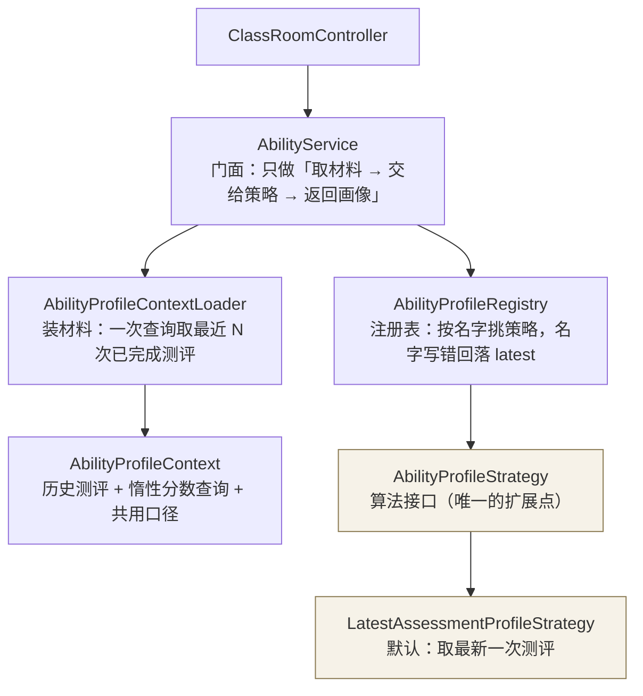

# 用户画像模块设计（算法可替换）

> 代码位置：`backend-java/src/main/java/com/huiqiyikang/assessment/profile/`
> 目的：把「用哪几次测评、怎么算出画像」从流程里抽出来，换算法时不改任何调用方。

---

## 1. 为什么抽这一层

改造前，「画像」这件事写死在 `AbilityService` 里：取该班级下最新一次已完成测评，把它的
综合分、等级、六维分、考察点分拼成接口返回。想换成「最近三次加权平均」「时间衰减」
「取最高分」，只能改这个类，然后所有调用方跟着受影响。

现在把它拆成三件事，各自独立变化：

| 关注点 | 归谁 | 变化频率 |
|---|---|---|
| **怎么算**（用哪几次、怎么组合） | 策略 `AbilityProfileStrategy` | 高，朋友会不断调 |
| **材料从哪来**（查库、缓存、惰性取分数） | `AbilityProfileContext` + `AbilityProfileContextLoader` | 低 |
| **当前用哪个策略** | `AbilityProfileRegistry` + 配置 | 低 |

---

## 2. 模块结构



对外的数据形状只有一个：`AbilityProfile`（record）。接口直接序列化它，字段名就是接口契约。

| 角色 | 类型 | 职责 |
|---|---|---|
| 策略 | `AbilityProfileStrategy` | 唯一的算法落点，`build(context)` 返回画像 |
| 上下文 | `AbilityProfileContext` | 把材料摆好：`history()`、`dimensionsOf()`、`pointsOf()`、`summaryOf()` |
| 注册表 | `AbilityProfileRegistry` | 收集所有策略实现，按配置或名字选用 |
| 门面 | `AbilityService` | 控制器唯一入口，保持极薄 |

**用到的设计模式**：策略（Strategy）承担算法替换，注册表是工厂（Factory / Registry）的
简化形态，`AbilityProfileContext` 是上下文对象（Context Object），`AbilityService` 是门面
（Facade）。同一个套路在 Python 侧已经用了三次——出题引擎 `QuestionEngine`、
评分工具 `ScoringTool`、学习建议 `AdviceWriter`，两边风格一致，换算法的人不用重新学。

---

## 3. 默认策略做什么

`LatestAssessmentProfileStrategy`（`name = "latest"`）复刻改造前的口径，做到换架构不换结果：

1. 取该班级下该学生**已完成的测评**，按完成时间倒序，`history[0]` 就是最新一次；
2. `latest` / `dimensions` / `points` 全部来自最新那一次；
3. `trend` 取最近 10 次（`TREND_LIMIT`）的综合分，**按时间升序**给折线图；
4. `previous` 是倒数第二次测评（带它自己的六维分），只有一次测评时为 `null`，前端据此显示
   「完成第二次测评后生成对比」；
5. 一条测评都没有时返回 `AbilityProfile.empty(classId)`，前端显示 L0 空状态。

综合分口径沿用两列回退：优先 `average_score`（六维分的平均），历史数据缺失时回退
`total_score`（所有题目分的平均）。等级统一走 `AbilityLevelScale.resolve()`，与
学生工作台、教师端用的是同一套档位。

---

## 4. 怎么加一个新算法

三步，不需要改控制器、接口形状或任何调用方：

1. 新建一个类实现 `AbilityProfileStrategy`，返回自己的 `name()`
2. 打上 `@Component`（注册表会自动收集，不用改注册表）
3. 把 `app.ability-profile.strategy` 配成这个名字

下面是一个可以直接抄的完整例子——**最近三次加权平均**（越新权重越高）：

```java
package com.huiqiyikang.assessment.profile;

import com.huiqiyikang.assessment.entity.Assessment;
import org.springframework.stereotype.Component;

import java.util.ArrayList;
import java.util.LinkedHashMap;
import java.util.List;
import java.util.Map;

@Component
public class WeightedRecentProfileStrategy implements AbilityProfileStrategy {

    /** 权重：最新一次 3 份、上一次 2 份、再一次 1 份。 */
    private static final double[] WEIGHTS = {3, 2, 1};

    @Override
    public String name() {
        return "weighted-recent";
    }

    @Override
    public AbilityProfile build(AbilityProfileContext context) {
        List<Assessment> history = context.history();
        if (history.isEmpty()) return AbilityProfile.empty(context.classId());

        List<Assessment> used = history.subList(0, Math.min(WEIGHTS.length, history.size()));

        // 按维度加权平均：维度分来自每一次测评自己的维度分明细
        Map<String, double[]> bucket = new LinkedHashMap<>();   // dimension -> [加权和, 权重和]
        double weightSum = 0;
        double scoreSum = 0;
        for (int index = 0; index < used.size(); index++) {
            Assessment assessment = used.get(index);
            double weight = WEIGHTS[index];
            Double score = context.averageScoreOf(assessment);
            if (score != null) {
                scoreSum += score * weight;
                weightSum += weight;
            }
            for (AbilityProfile.DimensionScore row : context.dimensionsOf(assessment.getId())) {
                double[] cell = bucket.computeIfAbsent(row.dimension(), key -> new double[2]);
                cell[0] += row.score() * weight;
                cell[1] += weight;
            }
        }

        Double average = weightSum > 0 ? round(scoreSum / weightSum) : null;
        List<AbilityProfile.DimensionScore> dimensions = new ArrayList<>();
        bucket.forEach((dimension, cell) ->
                dimensions.add(new AbilityProfile.DimensionScore(dimension, round(cell[0] / cell[1]), 0)));

        // 等级按加权综合分现算，用的是和别处一样的档位
        var level = context.levelScale().of(average);

        // 考察点分仍取最新一次（技能树只需要"现在的水平"）
        Assessment newest = history.get(0);
        return new AbilityProfile(
                context.classId(),
                true,
                new AbilityProfile.Summary(newest.getId(), average, level.code(), level.name(),
                        newest.getCompletedAt()),
                dimensions,
                context.pointsOf(newest.getId()),
                trendOf(context, history),
                null);
    }

    private static List<AbilityProfile.Summary> trendOf(AbilityProfileContext context, List<Assessment> history) {
        List<Assessment> recent = history.subList(0, Math.min(10, history.size()));
        List<AbilityProfile.Summary> trend = new ArrayList<>();
        for (int index = recent.size() - 1; index >= 0; index--) {
            trend.add(context.summaryOf(recent.get(index)));
        }
        return trend;
    }

    private static double round(double value) {
        return Math.round(value * 100) / 100.0;
    }
}
```

配好之后重启（或改环境变量）：

```bash
ABILITY_PROFILE_STRATEGY=weighted-recent ./mvnw spring-boot:run
```

启动日志会打印当前策略与全部可用策略：

```
画像策略：weighted-recent（可用：[latest, weighted-recent]）
```

---

## 5. 为什么放在 Java 侧实时算，而不是在 Agent 里算完落库

这是本次最关键的一个决策。画像可以有两种做法：

| 做法 | 何时计算 | 换算法的后果 |
|---|---|---|
| **A. 实时算（当前采用）** | 每次读接口时，用策略现算 | **历史数据立刻按新口径重新呈现** |
| B. 收尾时算完落库 | 测评结束时算一次写进表 | 改算法只对新测评生效，老数据要写迁移脚本重算 |

画像算法正是朋友会反复调的**那一件事**，所以选了 A：换算法之后不用重跑任何测评、不用
做数据迁移，历史数据立刻按新口径呈现。代价是每次读画像要查一次历史测评（一条 SQL，
分数明细按需惰性查询），对这个量级完全够用。

如果以后某个算法算起来很重（例如跨班级、跨学期的全量重算），做法是：**保留策略接口，**
在策略内部加缓存或物化表——接口和调用方都不用动。

---

## 6. 数据从哪来（表边界）

画像模块只读，不写。它读的东西由 Agent 在测评收尾时写好：

| 数据 | 表 | 谁写 | 画像模块怎么用 |
|---|---|---|---|
| 测评记录 | `assessments` | Java 建、Agent 收尾更新 | `history()` 的来源；`average_score` / `ability_level` / `completed_at` |
| 维度分 | `assessment_dimension_scores` | Agent 收尾时幂等写入 | `dimensionsOf(assessmentId)`（雷达图） |
| 考察点分 | `assessment_point_scores` | Agent 收尾时幂等写入 | `pointsOf(assessmentId)`（技能树） |
| 个人班级画像 | `student_class_profiles` | Agent 收尾时 upsert | **默认策略不读它**；它是「最新一次画像」的物化快照，留给教师端班级分析走批量查询 |

关于 `student_class_profiles` 要说清楚：它是 N16 要求的「个人班级画像的数据库」，语义是
**每个「学生 × 班级」一行、只保留最新一次测评的分数与等级**。自定义策略（加权、衰减等）
不读它，因为它的口径被钉死在「最新一次」。教师端要做班级分析时，按班级一次查出全班学生的
画像快照，比逐个实时算划算。

**班级隔离**由两处保证：`AbilityProfileContextLoader` 的查询一律带 `class_id`；
`ClassRoomController` 在调用前校验调用者是该班级的有效成员。同一个学生在不同班级的画像
互不影响。

---

## 7. 配置项

| 配置 | 环境变量 | 默认 | 作用 |
|---|---|---|---|
| `app.ability-profile.strategy` | `ABILITY_PROFILE_STRATEGY` | `latest` | 当前生效的画像策略名 |
| `app.ability-profile.history-limit` | `ABILITY_PROFILE_HISTORY_LIMIT` | `20` | 策略能看到的历史测评条数 |

两点提醒：

- **策略名写错不会把接口打挂**：注册表记一条 WARN 后回落到 `latest`，启动日志里能看到
  当前策略和全部可用策略。
- **`history-limit` 不影响默认口径**：`latest` 只用第一条，调大调小结果都一样；它只决定
  自定义算法能看到多少历史。要按「最近 N 次」算，记得让 N ≤ 这个值。

---

## 8. 测试

`AbilityProfileRegistryTest`（6 个用例）覆盖注册表的关键行为，全部不依赖数据库：

| 用例 | 验证什么 |
|---|---|
| 配置的策略被选中 | `strategy=weighted-recent` 时 `active()` 返回它 |
| 配置名写错回落 | `strategy=typo-name` 时回落到 `latest`，不抛异常 |
| 名字大小写与空格 | `"  LATEST "` 也能正确选中 |
| `byName` 精确选用 | 存在则返回该策略，不存在返回 `latest` |
| 策略名重复 | 启动即失败（`IllegalStateException`），避免两个实现互相覆盖 |
| 缺少兜底策略 | 启动即失败，避免画像接口无策略可用 |

```bash
cd backend-java && ./mvnw test
```

---

## 9. 与其它「可替换模块」的关系

这套写法在项目里已经是一致风格，朋友接手时可以按同一套心智模型改：

| 模块 | 接口 | 默认实现 | 位置 |
|---|---|---|---|
| **用户画像** | `AbilityProfileStrategy` | `LatestAssessmentProfileStrategy`（最新一次） | Java `profile/` |
| 评分 | `ScoringTool` | `LlmScoringTool`（模型按评分标准打分） | Python `agent/scoring_tool.py` |
| 出题 | `Engine`（`decide(context)`） | `RandomEngine`（范围内不重复随机） | Python `tools/question_selection.py` |
| 学习建议 | `AdviceWriter` | `RuleBasedAdviceWriter`（规则式） | Python `agent/advice.py` |

四个模块的扩展方式完全一样：**实现接口 → 注册/注入 → 配置选中**。

---

## 10. 已知限制与后续

1. **`points` 只来自单次测评**：默认策略与示例策略都取最新一次的考察点分。如果新算法想
   对考察点分也加权，直接用 `context.pointsOf(...)` 按同样的方式聚合即可，接口不用改。
2. **`trend` 目前固定取最近 10 次**：常量在 `LatestAssessmentProfileStrategy.TREND_LIMIT`。
   如果新算法的窗口和它不同，在策略里自己决定（示例代码里就是这么做的）。
3. **`ability_level` 由 Agent 落库**：策略里同时支持「读落库的等级」和「按分数现算」。
   如果新算法算出的综合分与落库值不同，用 `context.levelScale().of(score)` 现算，保证
   等级与分数一致。
4. **没有画像历史**：现在只能看到当前画像 + 与上一次的对比。要做「画像随时间变化」的
   曲线，需要在 `trend` 之外再引入画像快照表，属于新功能，不在本次抽象范围内。
